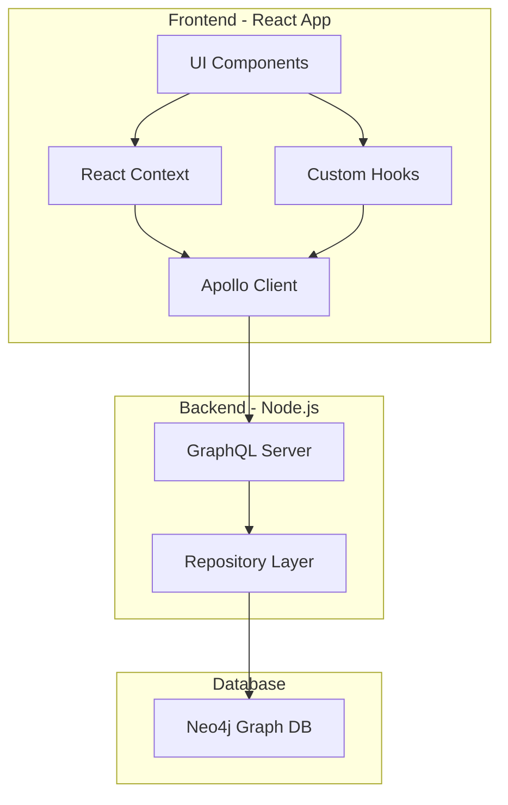
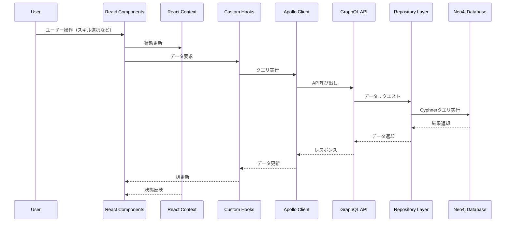

# SaGa Frontier2 連携可視化・検索ツール

このプロジェクトは、ゲーム「SaGa Frontier2」に登場する術・技同士の連携をグラフ構造で管理し、それを操作・可視化するフルスタックアプリケーションです。

---

## 📋 概要

- グラフデータベース（Neo4j）を使用して、ゲーム内のスキル連携を視覚的に表現
- スキルをカテゴリーごとにフィルタリングし、連携関係を探索可能
- スキルを選択して連携チェーンを構築する機能
- カテゴリベースのフィルタリングとグラフ可視化
- スキルスタッキング機能により連携チェーンを構築

---

## 🏗️ アーキテクチャ

### システムコンポーネント構成



### データフロー



---

## 📦 ディレクトリ構造

```
.
├── backend/                # Node.js + GraphQL サーバ
│   ├── src/
│   │   ├── infrastructure/ # 外部サービス接続レイヤー
│   │   ├── model/          # ドメインモデル
│   │   └── test/           # テストディレクトリ
│   └── package.json
│
├── frontend/              # React + Apollo クライアント
│   ├── src/
│   │   ├── api/           # API通信レイヤー
│   │   │   ├── graphql/   # GraphQLクエリ定義
│   │   │   ├── hooks/     # データフェッチング用カスタムフック
│   │   │   └── types.ts   # API型定義
│   │   ├── components/    # 共通コンポーネント
│   │   ├── features/      # 機能モジュール
│   │   │   └── skillChaining/ # スキル連携機能
│   │   │       └── skills/
│   │   │           ├── components/   # UIコンポーネント
│   │   │           ├── hooks/        # 機能特化カスタムフック
│   │   │           └── utils/        # ビジネスロジック
│   │   ├── layouts/       # レイアウトコンポーネント
│   │   └── utils/         # 共通ユーティリティ関数
│   └── package.json
│
├── neo4j/                 # Neo4j 用データとスクリプト
│   ├── data/              # CSVデータ
│   ├── init/              # 初期化Cypherスクリプト（レガシー）
│   ├── migrations/        # マイグレーションスクリプト
│   ├── tools/             # マイグレーションツール
│   └── docker-compose.yml # Neo4jコンテナ設定
│
└── docs/                  # ドキュメント
```

---

## 🚀 セットアップ手順

### 1. Neo4j 起動

```bash
cd neo4j
docker compose up -d
```

ブラウザで [http://localhost:7474](http://localhost:7474) にアクセス（認証なし）

### 2. Neo4jマイグレーションの実行

プロジェクトはNeo4jマイグレーションシステムを採用しています。必要なデータベーススキーマと初期データは全てマイグレーションスクリプトで管理されています。

```bash
# Docker Composeの起動時に自動的にマイグレーションが実行されます
cd neo4j
docker-compose up -d
```

マイグレーションの状態は以下のコマンドで確認できます：

```bash
docker-compose exec neo4j cypher-shell "MATCH (m:_Migrations) RETURN m"
```

また、Neo4jブラウザ（http://localhost:7474）から以下のCypherクエリを実行することでも確認できます：

```cypher
MATCH (m:_Migrations) RETURN m
```

#### 新しいマイグレーションの追加方法

1. `neo4j/migrations/` ディレクトリに新しいCypherファイルを作成します：
   ```bash
   touch neo4j/migrations/004_new_feature.cypher
   ```

2. マイグレーションファイルにCypherクエリを記述します。複数のステートメントはセミコロン（;）で区切ります。

3. Docker Composeを再起動するか、マイグレーションサービスを単独で実行します：
   ```bash
   # コンテナを再起動
   docker-compose restart
   
   # または、マイグレーションのみ実行
   docker-compose up migrations
   ```

### 3. バックエンドのセットアップ

```bash
cd backend
npm install
npm run dev
```

GraphQL エンドポイントが [http://localhost:4000/graphql](http://localhost:4000/graphql) に立ち上がります。

### 4. フロントエンドのセットアップ

```bash
cd frontend
npm install
npm run dev
```

ブラウザで [http://localhost:3000](http://localhost:3000) を開くとフロントエンドが確認できます。

---

## 📘 主要機能

### スキル連携グラフ可視化

- 選択したスキルから連携可能な全スキルをグラフ形式で表示
- 連携先となるスキルをノードとエッジで表現
- スキルは関連カテゴリによって色分け表示

### カテゴリベースのフィルタリング

- カテゴリ単位でスキル連携をフィルタリング
- 複数カテゴリを選択してフィルタリングも可能
- カテゴリに基づいて視覚的に区別するカラーコーディング

### スキルスタッキング機能

- 連携スキルを選択して連携チェーンを構築
- 選択したスキルを積み上げて表示
- 連携の可能性を視覚的に確認

---

## 🔍 技術詳細

### バックエンド

- **Node.js / TypeScript**: 型安全なバックエンド開発
- **GraphQL / Apollo Server**: クライアントに効率的なデータ提供
  - カテゴリとスキルの一覧を取得するクエリ
  - スキルの詳細と連携情報を取得するクエリ
  - カテゴリごとにスキルをフィルタリングするクエリ
- **Neo4j**: グラフデータベースによるスキル連携の自然な表現
- **Repository パターン**: データアクセスロジックの抽象化

### フロントエンド

- **React / TypeScript**: 型安全なUI開発
- **Apollo Client**: GraphQLデータフェッチングとキャッシュ
- **React Context API**: アプリケーション状態管理
- **ReactFlow**: インタラクティブなグラフ可視化

#### アーキテクチャパターン

##### 関心の分離（Separation of Concerns）
- **プレゼンテーション層**: UIコンポーネント（表示のみ責任）
- **ビジネスロジック層**: ユーティリティ関数による純粋な処理
- **データアクセス層**: カスタムフックによるデータフェッチング
- **状態管理層**: React ContextとuseReducerによる状態管理

##### カスタムフック
- **データフェッチング用**:
  - `useCategories`: カテゴリ一覧の取得
  - `useAllSkills`: 全スキルの取得
  - `useSkillsByCategory`: カテゴリ別スキルの取得
  - `useLinkedSkills`: スキル連携情報の取得
- **機能特化フック**:
  - `useSkillGraph`: グラフデータの生成とフィルタリング
  - `useGraphInteractions`: グラフのマウスインタラクション管理
  - `useSkillChainData`: 複数データソースの統合管理
  - `useSkillSelection`: スキル選択ロジックの管理
  - `useVisualizationMode`: 表示モードの状態管理

##### ユーティリティ関数
- `skillGraphUtils`: グラフデータの生成・フィルタリング処理
- `graphLayout`: 円形レイアウトの計算
- `categoryColors`: カテゴリカラーマッピング

##### 型定義の集約管理
- **中央管理型定義** (`types/index.ts`):
  - 共通インターフェース（コールバック、プロバイダー等）
  - Context関連の型（State、Action、ContextType）
  - 共有データ型（ノード、エッジ等）
- **コンポーネント固有型定義**: 各コンポーネントファイル内で管理

##### コンポーネント設計
- **Container/Presentational パターン**: ロジックとUIの分離
- **Compound Components**: 関連コンポーネントのグループ化
- **高凝集・疎結合**: 各コンポーネントが単一の責任を持つ

### データモデル

- **Category**: スキルカテゴリ情報と表示順序
- **Skill**: スキル情報とその所属カテゴリ
- **連携関係**: スキル間の方向性のある連携関係（有向グラフ）

---

## 📘 参考情報

- 連携のデータは以下のページを参考にしました。感謝申し上げます。  
  https://web.archive.org/web/20190329052637/http://www.geocities.jp/yama23neko/gamememo/sagafro2/conbi.html
